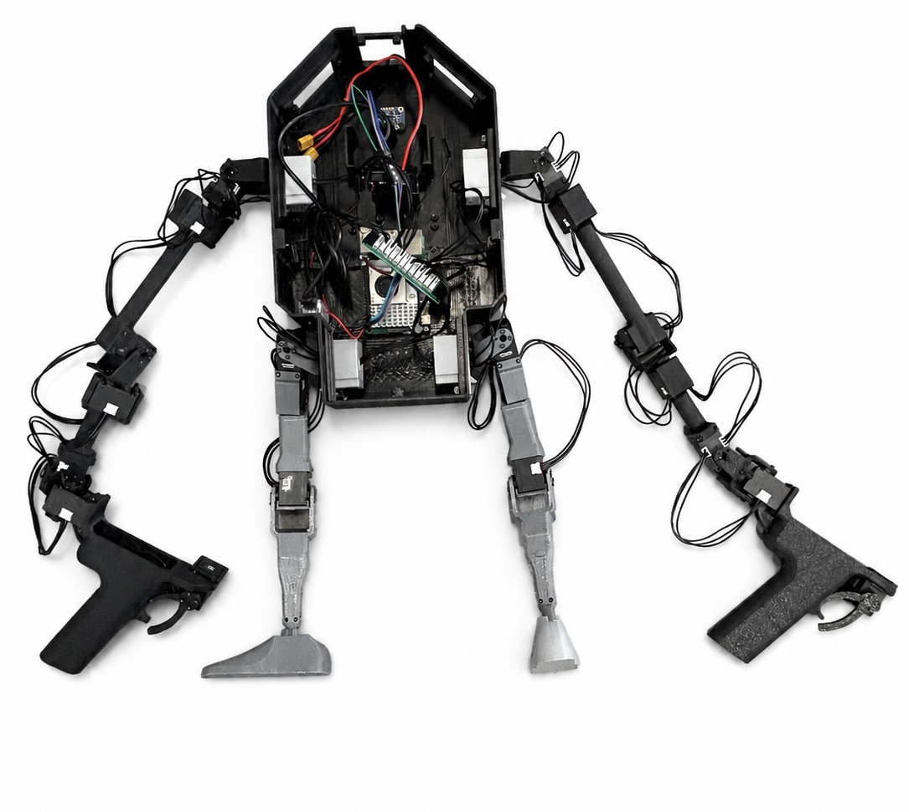

# ICS CHILD Teleoperation Workspace

ROS 2 Humble workspace manifest, installation scripts, and Docker environment
for the ICS CHILD teleoperation system.

This repository prepares the **CHILD/leader computer**. The G1 robot-side
Python environment is described separately below.

## Hardware overview

### CHILD leader hardware

<p align="center">
  
</p>

### Complete hardware connection

[](docs/hardware/child_hardware_connection.svg)

Click the connection diagram to open it at full size.

## Repositories

- [`CHILD`](https://github.com/shuowenLLL/CHILD): leader robot description,
  feedback controller, G1 teleoperation software, and DYNAMIXEL diagnostic
  tools.
- [`PAPRAS-V0-Public`](https://github.com/shuowenLLL/PAPRAS-V0-Public):
  provides the `papras_hardware_interface/DynamixelHardware` ROS 2 Control
  plugin used by `teleop_leaders`. It opens the DYNAMIXEL serial bus, applies
  the servo configuration, reads position/velocity/current, writes
  position/current commands, and contains the corrected XL330 indirect-read
  address (`230`).
- [`DynamixelSDK`](https://github.com/ROBOTIS-GIT/DynamixelSDK): low-level
  ROBOTIS serial communication SDK used by the PAPRAS hardware plugin and
  diagnostic scripts.
- [`dynamixel_interfaces`](https://github.com/ROBOTIS-GIT/dynamixel_interfaces):
  ROS 2 messages and services for reading, writing, rebooting, and monitoring
  DYNAMIXEL devices.
- [`ros-imu-bno055`](https://github.com/dheera/ros-imu-bno055): ROS 2 BNO055
  IMU driver.

The exact repository URLs and branches are recorded in
[`child.repos`](child.repos).

## Installation overview

Choose one route:

1. **Automatic Docker installation (recommended):** clone this repository and
   let the supplied scripts download all source repositories, install
   dependencies, and build the workspace.
2. **Manual native installation:** install ROS 2 and dependencies on the host,
   clone every source repository yourself, and build with `colcon`.

Do not copy `build/`, `install/`, or `log/` between machines. Recreate them by
building the workspace.

## Route 1: automatic Docker installation

Requirements:

- Docker Engine
- Docker Compose plugin (`docker compose`)
- a Linux host with access to the DYNAMIXEL USB adapter and BNO055 I2C device

Run:

```bash
git clone https://github.com/shuowenLLL/ICS-CHILD-Teleop.git
cd ICS-CHILD-Teleop

HOST_UID=$(id -u) HOST_GID=$(id -g) \
  docker compose -f docker/compose.yaml build

docker compose -f docker/compose.yaml run --rm teleop ./scripts/setup_workspace.sh
docker compose -f docker/compose.yaml run --rm teleop ./scripts/install_dependencies.sh
docker compose -f docker/compose.yaml run --rm teleop ./scripts/build_workspace.sh
```

`setup_workspace.sh` reads `child.repos` and downloads the five repositories
into `src/`. See [DOCKER.md](DOCKER.md) for container details and the equivalent
manual Docker workflow.

Start the leader:

```bash
docker compose -f docker/compose.yaml run --rm teleop bash
source install/setup.bash
export ROS_DOMAIN_ID=55
ros2 launch teleop_leaders leader_hw_g1_all_limbs.launch.py
```

## Route 2: manual native installation

This route targets Ubuntu 22.04 with ROS 2 Humble. First install ROS 2 Humble
using the [official ROS instructions](https://docs.ros.org/en/humble/Installation/Ubuntu-Install-Debs.html),
then install the required packages:

```bash
sudo apt update
sudo apt install -y \
  git build-essential cmake \
  python3-pip python3-serial python3-matplotlib \
  python3-colcon-common-extensions python3-vcstool python3-rosdep \
  i2c-tools libi2c-dev \
  ros-humble-xacro \
  ros-humble-hardware-interface \
  ros-humble-controller-interface \
  ros-humble-controller-manager \
  ros-humble-ros2-control \
  ros-humble-ros2-controllers \
  ros-humble-pinocchio \
  ros-humble-bno055
```

Initialize `rosdep` once:

```bash
sudo rosdep init
rosdep update
```

If `rosdep init` reports that the sources file already exists, continue with
`rosdep update`.

Clone the workspace manager and each source repository:

```bash
git clone https://github.com/shuowenLLL/ICS-CHILD-Teleop.git
cd ICS-CHILD-Teleop
mkdir -p src

git clone -b main https://github.com/shuowenLLL/CHILD.git src/CHILD
git clone -b ros2_humble https://github.com/shuowenLLL/PAPRAS-V0-Public.git src/PAPRAS-V0-Public
git clone -b humble https://github.com/ROBOTIS-GIT/DynamixelSDK.git src/DynamixelSDK
git clone -b humble https://github.com/ROBOTIS-GIT/dynamixel_interfaces.git src/dynamixel_interfaces
git clone -b master https://github.com/dheera/ros-imu-bno055.git src/ros-imu-bno055
```

Install remaining package dependencies and build:

```bash
source /opt/ros/humble/setup.bash

sudo rosdep install \
  --from-paths src \
  --ignore-src \
  --rosdistro humble \
  --skip-keys "rviz eigen_conversions cmake_modules open_manipulator_msgs robotis_manipulator gazebo_ros_control" \
  -r -y

colcon build --symlink-install
source install/setup.bash
```

Allow the current user to access serial devices, then log out and back in:

```bash
sudo usermod -aG dialout "$USER"
```

Start the leader:

```bash
cd ICS-CHILD-Teleop
source /opt/ros/humble/setup.bash
source install/setup.bash
export ROS_DOMAIN_ID=55
ros2 launch teleop_leaders leader_hw_g1_all_limbs.launch.py
```

The current leader configuration expects `/dev/ttyUSB0` at `1000000` baud.
Verify the port before starting real hardware.

## DYNAMIXEL setup and diagnostic tools

`CHILD/teleop_leaders` includes three tools for commissioning and diagnosing
the leader servos:

- `scan_servo_ids.py`: scans servo IDs and baud rates without changing servo
  settings.
- `edit_servo_config.py`: compares or applies the ID, return delay, homing
  offset, drive mode, operating mode, torque state, and baud rate from the
  leader YAML configuration.
- `single_servo_safe_test.py`: pings one servo and reads its position; movement
  is disabled unless `--move` is explicitly provided.

Before using these tools, stop `leader_hw_g1_all_limbs.launch.py` and any other
program using `/dev/ttyUSB0`. Only one process should access the DYNAMIXEL
serial port at a time.

From the workspace root, source the environment:

```bash
source /opt/ros/humble/setup.bash
source install/setup.bash
```

### Scan servo IDs and baud rates

Scan IDs `1..253` at all common baud rates:

```bash
ros2 run teleop_leaders scan_servo_ids.py --port /dev/ttyUSB0
```

Scan a smaller range at `1000000` baud:

```bash
ros2 run teleop_leaders scan_servo_ids.py \
  --port /dev/ttyUSB0 \
  --baud 1000000 \
  --start-id 1 \
  --end-id 22
```

Repeat `--baud` to scan several selected baud rates. The default protocol is
DYNAMIXEL Protocol 2.0.

### Configure and calibrate servos

`edit_servo_config.py` modifies the configuration stored in a DYNAMIXEL servo.
The current CHILD leader servos were configured from the complete joint
settings in the official CHILD file
`teleop_leaders/config/g1_leaders_all_limbs.yaml`. The file defines the target
ID, return delay, homing offset, drive mode, operating mode, and torque state
for every leader joint.

The script handles one servo per command. Repeat the procedure for each joint
when configuring the complete leader system. For safety, connect only one
servo at a time, or specify its current ID explicitly with `--id`.

List the available joints and their target IDs:

```bash
ros2 run teleop_leaders edit_servo_config.py --list-joints
```

Preview the official YAML configuration for one joint:

```bash
ros2 run teleop_leaders edit_servo_config.py \
  --port /dev/ttyUSB0 \
  --baud 1000000 \
  --joint right_shoulder_pitch_joint
```

This is a dry run: it reads the servo and displays the planned changes without
writing them. After checking the current servo, joint name, and target values,
add `--yes` to apply the configuration:

```bash
ros2 run teleop_leaders edit_servo_config.py \
  --port /dev/ttyUSB0 \
  --baud 1000000 \
  --joint right_shoulder_pitch_joint \
  --yes
```

Command-line options can override values from the YAML file. For example, use
`--homing-offset` to apply a manually determined calibration offset:

```bash
ros2 run teleop_leaders edit_servo_config.py \
  --port /dev/ttyUSB0 \
  --baud 1000000 \
  --id 1 \
  --new-id 1 \
  --homing-offset 2048
```

Review the dry-run output, then repeat the command with `--yes` to write it.
The tool can also override `--new-id`, `--return-delay`, `--drive-mode`,
`--operating-mode`, `--torque-enable`, and `--target-baud`.

Calibration here means writing a known `Homing Offset`; the script does not
automatically measure or calculate the correct offset. Do not confuse the
current servo ID (`--id`) with the desired ID (`--new-id` or the ID selected by
`--joint`).

### Test one servo safely

Ping ID `1` and read its current position without enabling torque:

```bash
ros2 run teleop_leaders single_servo_safe_test.py \
  --port /dev/ttyUSB0 \
  --baud 1000000 \
  --id 1
```

Only after the servo is mechanically safe to move, request a small movement:

```bash
ros2 run teleop_leaders single_servo_safe_test.py \
  --port /dev/ttyUSB0 \
  --baud 1000000 \
  --id 1 \
  --move \
  --amplitude 50
```

The movement test enables torque temporarily and disables it after the test.
Keep people and equipment clear of the mechanism.

If `ros2 run` cannot find one of the scripts after updating `CHILD`, rebuild the
package:

```bash
source /opt/ros/humble/setup.bash
colcon build --symlink-install --packages-select teleop_leaders
source install/setup.bash
```

## G1 robot-side installation

The G1 side is separate from the CHILD/leader Docker environment. Based on the
original
[`Teleop_Instruction.md`](https://github.com/shuowenLLL/CHILD/blob/main/Teleop_Instruction.md),
create a smaller ROS workspace and skip the leader hardware package:

```bash
mkdir -p ~/ws_child/src
cd ~/ws_child/src
git clone -b main https://github.com/shuowenLLL/CHILD.git
touch CHILD/hw_interface/teleop_leaders/COLCON_IGNORE

cd ..
source /opt/ros/humble/setup.bash
colcon build --symlink-install
```

Create the Python environment and install the teleoperation dependencies:

```bash
cd ~/ws_child/src/CHILD
python3.8 -m pip install --user virtualenv
python3.8 -m virtualenv venv_child
source venv_child/bin/activate
pip install -r teleop_sw/requirements.txt

git clone https://github.com/unitreerobotics/unitree_sdk2_python.git
pip install -e unitree_sdk2_python
```

If a legacy requirement reports a `libxml2` installation error:

```bash
pip install lxml --only-binary :all:
pip install -r teleop_sw/requirements.txt
```

Edit `teleop_sw/cyclonedds.xml` and replace the two placeholder peer addresses
with the CHILD and G1 Wi-Fi IP addresses. Both machines must use the same
`ROS_DOMAIN_ID`, normally `55`.

Start the G1 teleoperation program:

```bash
export CYCLONEDDS_URI=file://$HOME/ws_child/src/CHILD/teleop_sw/cyclonedds.xml
export ROS_DOMAIN_ID=55

cd ~/ws_child
source install/setup.bash
source src/CHILD/venv_child/bin/activate
cd src/CHILD/teleop_sw

python -m run_g1_upper_body
# Or, in the appropriate G1 debug mode:
python -m run_g1_full_body_teleop
```

Follow the G1 operating-mode and emergency-stop instructions in the original
`Teleop_Instruction.md` before enabling real hardware.

## Updating and rebuilding

For an automatically imported workspace:

```bash
vcs pull src
./scripts/install_dependencies.sh
./scripts/build_workspace.sh
```
